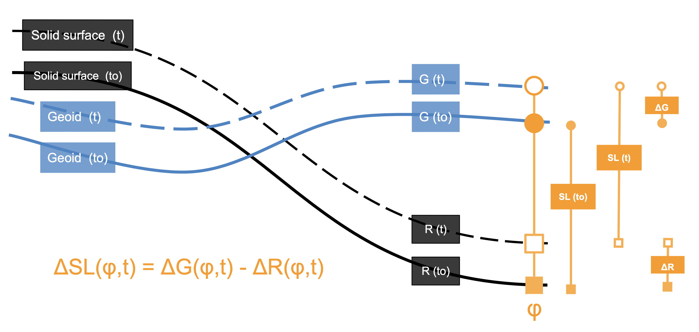

---
#########################################
# options for knitting a single chapter #
#########################################
output:
  #bookdown::html_document2: default
  #bookdown::word_document2: default
  bookdown::pdf_document2:
    template: templates/brief_template.tex
    citation_package: biblatex
documentclass: book
bibliography: references.bib
---
# Theoretical framework {#framework}

Comparing sea-level indicators (SLIs) and glacial isostatic adjustment (GIA) models requires an understanding of different elements of sea-level research. The following section presents the state-of-the-art of SLIs and GIA models and summarizes the definitions of standard terms and mathematical relationships between the different elements required for the following chapters. Different chapters of the *Handbook of sea-level research* edited by @Shennanhandbook are primary references.

## Sea level and relative sea level

Following the definition proposed by @mitrovica2003post and the notation suggested by @Shennan2015research, *sea level (SL)* is the distance between the geoid (**G**) and the solid surface (**R**) for a geographic location $\varphi$ at a time **t** (see Figure \@ref(fig:rsl-figure)). The following equations proposed by @mitrovica2003post summarize the relationship between these parameters and their relative movement through time:

\begin{equation}
SL(\varphi,t) = G(\varphi,t) -  R(\varphi,t)
(\#eq:sealevel)
\end{equation}
\begin{equation}
\Delta SL(\varphi,t) = \Delta G(\varphi,t) - \Delta R(\varphi,t)
(\#eq:deltasealevel)
\end{equation}
with 
\begin{equation}
\Delta G(\varphi,t) = G(\varphi,t) - G(\varphi,t_{0})
(\#eq:deltageoid)
\end{equation}
\begin{equation}
\Delta R(\varphi,t) = R(\varphi,t) - R(\varphi,t_{0})
(\#eq:deltasurface)
\end{equation}
where $t_{0}$ is a reference time.

```{r rsl-figure, fig.cap= 'Relative sea level changes and their relationship with geoid (G) and solid surface (R) relative movements.',fig.scap='Diagram of relative sea level changes', echo = FALSE, message = FALSE, warning=FALSE, out.width = "90%",fig.align = "center"}

```

@Shennan2015research explains that the common practice is to calculate the change on SL relative to the present for recent time scales. Consequently:

\begin{equation}
RSL(\varphi,t) = SL(\varphi,t_{past}) - SL(\varphi,t_{present})
(\#eq:rsl)
\end{equation}

Changes on the geoid **G**, the solid surface **R**, and their relative position result from the interaction of multiple earth processes with different regional and temporal extents. @Shennan2015research summarizes RSL changes and their underlying changes in the geoid and the surface with the following equations:

\begin{equation}
\small
\begin{split}
\Delta RSL(\varphi,t) = \Delta EUS(t) +\Delta ISO(\varphi,t) + \Delta TECT(\varphi,t) \\
+ \Delta LOCAL(\varphi,t) +\Delta UNSP(\varphi,t)
\end{split}
(\#eq:rsl-process)
\end{equation}

with $\Delta EUS(t)$ as eustatic changes, $\Delta ISO(\varphi,t)$ as isostatic changes, $\Delta TECT(\varphi,t)$ as tectonic changes, $\Delta LOCAL(\varphi,t)$ as local changes and $\Delta UNSP(\varphi,t)$ as unspecified changes.

Eustatic changes ($\Delta EUS(t)$) are the combination of processes that affect the mass or volume of water in the oceans resulting in global variations of sea level [see @Shennan2015research; and @rovere2016slc]. Unlike the other factors in Equation \@ref(eq:rsl-process), eustatic changes are by definition not spatially dependent ($\varphi$) as their net variations are uniform around the globe. Some eustatic processes include changes in water mass due to melting or accumulation of ice, redistribution of water sources (not ice-related), or changes in water volume due to density variations in response to temperature changes [@rovere2016slc]. Beyond the global sea-level changes due to the eustatic process, water mass and distribution changes trigger other non-eustatic changes.

Other parameters from equation \@ref(eq:rsl-process) respond to multiple processes in different spatial and temporal ranges. The isostatic component  ($\Delta ISO(\varphi,t)$) is an example of sea-level changes that respond to the eustatic process. This factor includes the effect of the glacial rebound process (i.e., glacial isostatic adjustment) in response to changes in ice and water load over the lithosphere, gravitation effects, and changes due to rotational effects resulting from ice and water redistribution [@Shennan2015research]. In contrast, sea-level changes due to tectonic processes ($\Delta TECT(\varphi,t)$) are not associated with eustatic changes. This factor includes vertical changes in various time scales due to tectonic forces resulting in interseismic uplift or coseismic subsidence [@rovere2016slc]. Local changes ($\Delta LOCAL(\varphi,t)$) as defined by @Shennan2015research include variations due to tidal regime ($\Delta TIDE(\varphi,t)$) and sedimentation processes ($\Delta SED(\varphi,t)$). The importance of these processes is that they have high spatial variability in response to local characteristics and processes (e.g., geological, biological, and human-driven) that result in different rates of important sea-level change drivers as sediment compaction [@rovere2016slc]. Lastly, $\Delta UNSP(\varphi,t)$ correspond to any external factor from the other sea-level change driver that can not be quantified. As mentioned @Shennan2015research, under specific conditions (e.g., region or time), one or more of these factors can be considered negligible.

## Sea-level indicators

To perform studies in geological time scales, researchers use sea-level indicators (SLI) as tools to infer previous relative sea level (RSL) and their variation through time. An SLI is a collection of evidence and interpretation of preserved features that estimate paleo-sea levels by defining four parameters: location, age, elevation, and tendency [@Shennan2015research]. Sources of evidence include sedimentary, fossil, and archaeological material of an area [@Shennan2015research]. As the determination of location, age, elevation, and the tendency of an SLI requires the combination of interpretations of multiple features, it is considered the result of proxy reconstruction methods rather than observations of sea level [@Shennan2015research]. 

The core information of an SLI can be summarized in a short phrase:

> *Sea level 10.000 years ago (Age) at this beach (location) was 3 meters above/below (RSL) current sea level*

However, the context of the final numeric parameters (Age and RSL) consist of the details of the preserved features, the combination of results of different techniques, and the interpretations of these features with their errors and uncertainties [see @Shennan2015research; @hijma2015protocol]. @hijma2015protocol proposes a sea-level database structure to store the required context information for the SLIs and avoid erroneous inferences. This information includes details about the samples (evidence), dating techniques (age), elevation measurements, datum, and error of measurements. With a similar approach, @Rovere2020 propose the World Atlas of Last Interglacial Shorelines (WALIS) as a database structure focused on SLI from around 130 ka. The database structure preserves the most relevant information taking into account usual methods used to measure the different parameters of SLI (e.g., most common Quaternary dating methods) [see @rovere2019world].

In the following sections, the Age and Elevation parameters of an SLI will be explained using the WALIS notation and focusing on the essential features for the Last Interglacial.

### Age parameter

The age parameter of an SLI results from the combination of absolute and relative dating processes available from the material (e.g., rock samples). In the database structure proposed by @Rovere2020, there are six dating techniques categories: *uranium-thorium series (U-Series)*, *Amino acid racemization (AAR)*, *Electron spin resonance dating (ESR)*, *Luminescence*, *Stratigraphic constraint* and *others*. Age calculation resulting from these techniques consists of two groups: (1) Radiometric ages (Absolute) and (2) temporal constraints (Relative). Radiometric dating techniques for samples during the last interglacial (128–116 ka) are predominantly U-Series, Luminescence, and ESR.
[@rovere2016sli]. Moreover, datings results are usually reported with 1-sigma errors ranging from 0.5 to 20 ka. Relative dating techniques such as AAR or stratigraphic constraints result in temporal ranges (upper and lower age) defined by known subdivisions of geologic time. In general, these techniques allow distinguishing from interglacial periods [@rovere2016sli]. An essential feature from the WALIS database structure is that SLI could have more than one Age constraint. That is possible as the SLI material may allow multiple observations (e.g., more than one distinct type of fossil) or multiple dating techniques.

### Elevation parameter

The elevation parameter (paleo RSL) of an SLI represents its formation position relative to tide levels under the assumption that this distance is constant [@hijma2015protocol]. For a sample (*s*),  the RSL parameter results from the following equations:

\begin{equation}
RSL = RWL - E_{s}
(\#eq:elevation)
\end{equation}

with Reference Water level (*RWL*) as the middle point of the range over which an indicator forms (i.e., Indicative Range) and $E_s$ its current elevation relative to tide levels [see @hijma2015protocol]. The definition of an Indicative range (*IR*) for a sample depends on the characteristics of the indicator, and there are multiple methods to define it. One example is by direct comparison with modern elevation distributions [see @Woodroffe2015rwl]. These two parameters (i.e., RWL and IR) are the *indicative meaning* of sea-level indicators. @rovere2016sli summarize a series of formulas to calculate *RWL*, *IR*, and their uncertainty from modern analogs:

\begin{equation}
RWL= \frac{U_{l}+L_{l}}{2}
(\#eq:modernrwl)
\end{equation}

\begin{equation}
IR= U_{1}-L_{1}
(\#eq:errorrwl)
\end{equation}

\begin{equation}
\delta_{RSL}= \sqrt{E^{2}_e+(\frac{IR}{2})^{^{2}}}
(\#eq:deltarsl)
\end{equation}

with $U_{l}$ and $L_{l}$ being the upper and lower limit of the modern analog, $\delta_{RSL}$ the RSL uncertainty, and ${E}_e$ the standard deviation of the elevation measurement.  

The resulting relative sea level parameter (RSL) is not necessarily a bounded interval, but it could also be an unbounded interval at one of its limits. As pointed out by @rovere2016sli, some indicators do not provide the evidence to quantify the position relative to a tide level, but a relative position can be derived. For example, a sample with freshwater origin does not have a direct tide level equivalency, but it indicates the relative sea level position [@hijma2015protocol].

## Sea-level indicators types

Depending on the combination of Age and RSL parameters, SLIs can be classified either as limiting indicators or sea-level index points (SLIPs).  

### Limiting indicators

Limiting data points are the indicators with an unknown *indicative meaning* that can not be associated with a past tide level (i.e., unbounded interval) [see @hijma2015protocol]. Depending on the characteristics of the sea-level indicators (SLI), they can be either Lower or Upper limiting data points. For example, marine organisms with uncertain vertical living ranges are lower limiting data points (or marine limiting), and freshwater samples are upper limiting data points (or terrestrial limiting) [see @hijma2015protocol]. In short, marine limiting indicates that the RSL was *above* certain level, and terrestrial limiting that the RSL was *below* that position. 

### Sea level index point

Contrary to limiting data, sea-level index points (SLIPs) are indicators with a known *indicative meaning* that can be associated with a past tide level (i.e., bounded RSL interval) [see  @hijma2015protocol]. @Rovere2020 explicitly differentiate SLIPs and limiting indicators in their proposed database structure and include for SLIPs the upper ($U_{l}$) and lower ($L_{l}$) limits of the modern analog. As these parameters are known, Equation \@ref(eq:errorrwl) applies to SLIPs. The Age parameter of a SLIP can result either from absolute or relative dating methods, and its graphic representation is a range with the error of the technique [@Rovere2020].

### Sea level index point models

As pointed by @ashe2019statistical in a compilation of statistical modeling methods for relative sea level, RSL models from SLIPs allow the study of sea-level changes for larger timescales than modern records. The authors mention that, as in the case of another type of sea-level information (e.g., Tide gauges, core records), the objective of statistical models is to estimate relative sea level evolution. That allows to quantify rate changes, identify spatial variability, and compare with other sources of sea-level information.

In their compilation, @ashe2019statistical identify five different statistical techniques used in the literature for sea-level index points (SLIPs).

1. Simple Linear Regression
2. Errors-in-variable Change-point
3. Errors-in-variable Integrated Gaussian process
4. Probabilistic Ensembles
5. Gaussian processes

In the compilation, @ashe2019statistical analyze the different methods from a hierarchical statistical modeling perspective. The authors identify two different levels for the hierarchical modeling of RSL with SLIPs: data and process level. In this context, the data level corresponds to the observation and measurement of the process (e.g., temporal uncertainties) and the process level to the characteristics of sea-level changes (e.g., variability, process noise). 

These models have different approaches to handling SLIPs concerning their data and process levels. One main difference in the data level is how the temporal uncertainty of SLIPs is included. @ashe2019statistical point out that contrary to instrumental measurements of sea level, SLIPs inherit significant temporal uncertainties from dating techniques (i.e., radiometric dating). Some regression techniques assume time as an independent variable ignoring this aspect of SLIPs. Other methods such as Errors-in-variable techniques employ Markov chain Monte Carlo (MCMC) sampling distributions to include temporal uncertainties [@ashe2019statistical].

## Sea level deterministic models

Sea-level changes combine the dynamics of various processes with different temporal and spatial extent [see @mitrovica2003post; @Shennan2015research]. One of the approaches to estimate the influence of these processes is the incorporation of modeling procedures. As pointed out by @ashe2019statistical, Spatio-temporal sea-level models include a spectrum of approaches from purely statistical to purely physical models. Implementing purely physical (deterministic) models is typical for different sea-level processes. For example, to model global-to-regional processes as the glacial isostatic adjustment (GIA) ($\Delta ISO_{GIA}$), and local $\Delta LOCAL$ processes as changes due to the tidal regime and sediment compaction [see @Shennan2015research]. For the temporal scope of the study, GIA models ($\Delta ISO_{GIA}$) are of interest for comparison with sea-level indicators. @Milne2015 points out that during the Quaternary, the glacial isostatic adjustment is the process that records the response to the main driver of relative sea level for this period: variations of spatial distribution and volume of ice sheets. 

### Glacial isostatic adjustment models

The objective of GIA models is to estimate the isostatic response of the earth to the redistribution of ice-water mass [see @Milne2015; @Shennan2015research]. Even though first references to effects of ice-water mass distribution in sea-level changes are attributed to @jamieson1865history, @farrell1976postglacial first introduced physical modeling of this process. For the modeling of sea-level changes, @Milne2015 identifies two significant consequences of ice-water mass distribution: changes in the vertical position of the ocean floor and changes in the ocean surface. On the one hand, changes of the ocean floor (**R** Solid surface) result from isostatic deformation (i.e., elastic response). On the other hand, changes in the ocean level correspond to changes in the earth's gravitational field (due to mass redistribution) and the influx of water (e.g., meltwater) into the oceans. 

@Milne2015 highlights the nature of these changes and their relevance for GIA models. For example, consequences due to the influx or outflow of water are considered eustatic changes (i.e., $\Delta EUS$) and are not included in the GIA component. Similarly, the modeled GIA component is relevant to the isostatic effect ($\Delta (ISO)$), but it is not the only factor. The isostatic ($\Delta ISO$) component also includes the gravitational attraction effect responding to GIA. As explained by @rovere2016slc, the mutual gravitational pull between water masses and ice sheets varies depending on the distribution and relative size of both elements. This component is called sea-level fingerprint ($\Delta ISO_{fingerprint}$). Consequently, GIA models require additional sea-level fingerprints modeling to represent all isostatic changes. In general, for areas without other isostatic phenomena (e.g., volcanic or karst isostasy), the following relation applies:

\begin{equation}
\Delta ISO = \Delta ISO_{GIA} + \Delta ISO_{fingerprint}
(\#eq:isogiafingerprint)
\end{equation}

To estimate $\Delta ISO_{GIA}$, modelers integrate the different interactions between ice-water mass redistribution and relative sea level using different versions of the *sea-level equation* proposed by @farrell1976postglacial. Beyond the mathematical particularities of the *sea-level equation* discussed by @farrell1976postglacial, @Milne2015 illustrates the fundamental components of GIA modeling in relationship with this equation. First, the author identifies two inputs required to solve the sea-level equation: and Ice and Earth model. The former describes the Spatio-temporal evolution of ice sheets, and the latter the physical properties of the earth. @Milne2015 points out that both inputs derive from adopting paradigms that describe the structure and behavior of materials (e.g., rheological models) and their interactions. GIA modelers aim to find the set of conceptual models (e.g., lithospheric model), parameters (e.g., mantle viscosity), and variation of the *sea-level equation* that better describe observed sea-level changes.

@Milne2015 points out that GIA modelers modify the parameters to determine those that better adjust to other relative sea level information. Due to the increasing complexity of the input models, the addition of parameters, and variations to the *sea-level equation*, determining the best fitting model requires automated approaches. As an example relevant for this study, the GIA models used by @dendy2017 and @Dyere2021 have three parameters related to the physical properties of earth and two parameters related to ice-sheets evolution. The former corresponds to the Upper and Lower mantle viscosity and the lithospheric thickness. Furthermore, the latter corresponds to the *Ice model* and the *ice propagation line*. For the earth's properties, parameters vary in physical values. For example, Upper mantle viscosity has two possible values (0.3 or 0.5 x $10^{23}Pa s$), while the lower mantle has six different options (3 to 30 x $10^{23}Pa s$ in irregular steps). In contrast, ice parameters often output from other modeling methodologies for a particular subprocess. For example, the *Ice model* parameter could take the values from ice thickness evolution from a series of models as the 'ICE6G' published by @roy2015.