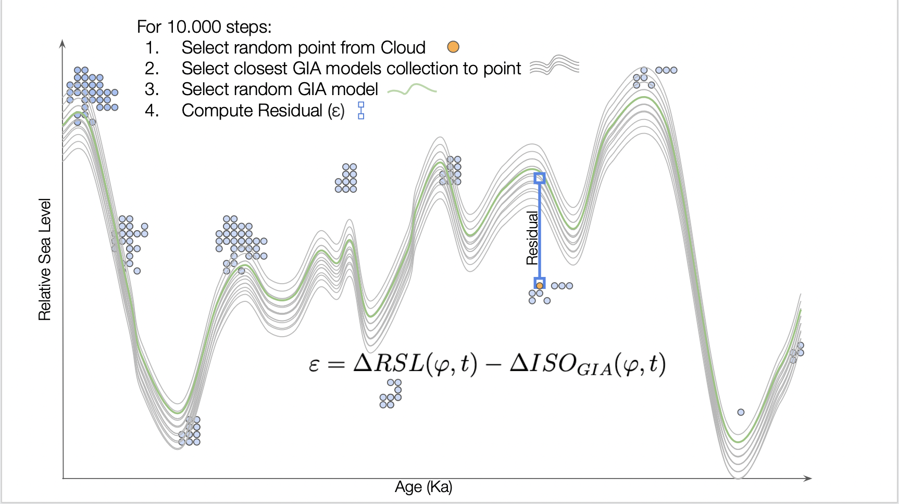

---
#########################################
# options for knitting a single chapter #
#########################################
output:
  bookdown::pdf_document2:
    template: templates/brief_template.tex
    citation_package: biblatex
  bookdown::html_document2: default
  bookdown::word_document2: default
documentclass: book
bibliography: references.bib
---

# Methodology {#methodology}


```{r load-packages-methodology, echo = FALSE, message = FALSE,error=FALSE,warning=FALSE}

# Load libraries
library(sf)
library(dplyr)
library(kableExtra)
library(ggplot2)
library(gridExtra)
library(cowplot)
library(stars)
```

The proposed methodology for comparing sea-level indicators and sea-level models consists of algorithms to compute the difference between $RSL$ recorded by SLIs and the glacial isostatic adjustment models ($\Delta ISO_{GIA}(\varphi,t)$). Due to their differences, SLI and limiting data points have different manipulations. In general terms, the methodology consists of random sampling in both age and RSL parameters for the SLI and then compute a Monte Carlo simulation process that randomly samples the GIA models and calculates the difference with SLI values. Following Equation \@ref(eq:rsl-process) and \@ref(eq:isogiafingerprint) the subtraction results in a residual ($\varepsilon$):

\begin{equation}
\small
\begin{split}
\begin{aligned}
\Delta RSL(\varphi,t) - \Delta ISO_{GIA}(\varphi,t) = \Delta ISO_{fingerprint} + \Delta EUS(t) \\ + \Delta TECT(\varphi,t) + \Delta LOCAL(\varphi,t) +\Delta UNSP(\varphi,t)
\end{aligned}
\end{split}
(\#eq:residual-delta)
\end{equation}
\begin{equation}
\begin{aligned}
\varepsilon &= \Delta RSL(\varphi,t) - \Delta ISO_{GIA}(\varphi,t)
\end{aligned}
(\#eq:residual-rsl-iso)
\end{equation}
\begin{equation}
\begin{split}
\varepsilon = \Delta EUS(t) + \Delta ISO_{fingerprint}(\varphi,t) +\Delta TECT(\varphi,t) \\+ \Delta LOCAL(\varphi,t) +\Delta UNSP(\varphi,t)
\end{split}
(\#eq:residual)
\end{equation}

## Extraction of distribution parameters

As the database structure of WALIS proposed by @Rovere2020 allows multiple chronological constraints for a single SLI, an initial step requires the extraction of the distribution parameters for Age and RSL. The following section explains the method to extract each component from the SLI.

### Sea level index points

#### Age

For the WALIS database structure [see @Rovere2020], there are two types of age constraints: (1) radiometric dating (absolute dating) and (2) MIS Assignment (relative dating). In the latter, temporal constraints are considered continuous uniform distribution as it is equally probable that the SLI lies at any point within the time constraint range. Consequently, age parameters for uniform distributions are *Lower Age* and *Upper Age*. In contrast, radiometric dating ages are reported from their dating techniques as normal distributions. For that case, extraction parameters consist of the mean value ($\mu$) and two times the standard deviation $2\sigma$ of the age estimation. After identifying and extracting the Age constraints parameters, each constraint (dating method) is assigned an equal probability to be the correct constraint. For example, for an SLI with $N$ number of chronological constraints, every constraint is assigned the same probability parameter ($prob$) following the equation:

\begin{equation}
\begin{aligned}
prob = 1/N
\end{aligned}
(\#eq:prob)
\end{equation}

```{r age-nopeak-proc, echo = FALSE, message = FALSE, warning=FALSE}

source('../Methods/extract_age.R')
# Import WALIS
walis<-read.csv("../Data/walis.csv")
RSL_example <- walis[walis$WALIS_ID=='RSL_700',]
RSL_example<-st_as_sf(RSL_example,coords=c("Longitude","Latitude"))
age_RSL_example <- extract_age(RSL_example,10000)

```

Table \@ref(tab:age-nopeak) shows the resulting extraction of Age parameters for sea-level indicator `r (unique(RSL_example$WALIS_ID)[1])` from `r (unique(RSL_example$Region)[1])`, `r (unique(RSL_example$Nation)[1])` [@cerrone2021]. In this example, the SLI have more than one temporal constraint from different dating techniques (i.e., radiometric dating and MIS assignment). 

```{r age-nopeak, echo = FALSE, message = FALSE, warning=FALSE}

total_dist <- age_RSL_example$distributions$total[,c('Type.of.datapoint','Age.calculation.from','Age_mu','Age_2s','Lower.age','Upper.age','prob')] 
rownames(total_dist) <- c(1:nrow(total_dist))

total_dist%>% knitr::kable(caption = "Extraction of Age parameters for SLIPs",
                           col.names = c('Type of datapoint','Age calculation from', '$\\mu$','$2\\sigma$','Lower age','Upper age', 'Probability'), digits=2, escape = FALSE, booktabs=T) %>% kable_styling(font_size = 10,latex_options = c("striped", "scale_down","HOLD_position"))
```


##### Uniform distributions in peaks

There is a variation in the extraction of Age parameters for uniform distributions. This variation allows the extraction from only the age ranges that correspond to peaks (highstand) of sea level in the stack published by @Spratt2016stack (Figure \@ref(fig:stack-peaks)). This stack of sea-level variation during the last 800 ka comes from multiple proxies from ocean sediment core data. The peaks and their characteristics (e.g., width, initial, and endpoint) are determined using the `findpeaks()` functions from the `pracma` package [see @hanspracma].

An age range from peaks is defined by the width $W_{ap}$ of the range  (Initial $A_{Ip}$ and Endpoint of peak $A_{Ep}$), the age of peak maximum ($A_{Mp}$) and a factor ($f$) adjusting the width of the range. Given a peak with $A_{Ip} = 10$, $A_{Mp}= 20$, $A_{Ep}= 32$, and $f=0.1$ the range limits is define as:

\begin{equation}
\begin{split}
W_{ap}= A_{Ep}-A_{Ip} \\
W_{ap}= 32-10 \\ 
W_{ap}= 22 \\
\end{split}
(\#eq:width)
\end{equation}

\begin{equation}
\begin{split}
[A_{Mp}-(W_{ap}*f),  A_{Mp}+(W_{ap}*f)] \\
[20-(22*0.1),  20+(22*0.1)] \\
[17.8,22.2]
\end{split}
(\#eq:range)
\end{equation}

```{r stack-peaks, fig.cap= 'Ranges for uniform distribution sampling from sea level high stands. Blue areas correspond to age ranges to sample.',fig.scap='Ranges for uniform distribution sampling', echo = FALSE, message = FALSE, out.width = "90%",fig.align = "left"}
source('../Methods/define_peaks_ranges.R')

sl_stack_spratt <- read.csv("../Data/sea_level_stack_spratt.csv", sep = "")
pr <- define_peaks_ranges(sl_stack_spratt,width = 0.2)
p_y <- unlist(sl_stack_spratt[pr[, 2], 'X50.'])
p_x <- unlist(sl_stack_spratt[pr[, 2], 'Age.ka.'])
plot(
  p_x,
  p_y,
  ylim = c(-150, 10),
  xlim = c(180, 0),
  xlab = "Time (Ka)",
  ylab = "Sea level (m)"
)
plot_rec <- function(x) {
  rect(
    xleft = x['up'],
    ybottom = -170,
    xright = x['low'],
    ytop = x['X1'],
    col = rgb(0, 0, 1.0, alpha = 0.1),
    border = NA
  )
}
g <- apply(pr, 1, plot_rec)
lines(unlist(sl_stack_spratt['Age.ka.']), unlist(sl_stack_spratt['X50.']), type = 'l')


```

Code required to extract peaks from the sea-level stack published by @Spratt2016stack is available in the file `Methods\define_peaks_ranges.R`.

As a uniform constraint could intersect more than one peak range, one uniform distribution from the initial age constraints could result in different smaller uniform distributions around sea-level peaks. In that case, the *peak ranges* (Figure \@ref(fig:stack-peaks)) replace the initial age constraints, and its probability $prob$ corresponds to the division by the number of *peak ranges* intersected. Table \@ref(tab:age-peaks) illustrates the parameter extraction for SLI `r (unique(RSL_example$WALIS_ID)[1])` in which one of the initial age constraints intersects multiple *peak ranges*. For Age constraints that do not intersect any *peak range*, extraction parameters stay unmodified. Similarly, temporal constraints from radiometric ages stay unmodified (parameters and $prob$ value). Age extractions using this method are denominated as *Peak sampling* for future references in this text. An extraction of Age that keeps the original Uniform distribution parameters is called *No-peak sampling*.

Code required to extract the Age parameter from sea-level indicators is available in `Methods\extract_age.R`.

```{r age-peaks, echo = FALSE, message = FALSE, warning=FALSE}

age_RSL_example <- extract_age(RSL_example,10000, peaks = pr)

total_dist <- age_RSL_example$distributions$total[,c('Type.of.datapoint','Age.calculation.from','Age_mu','Age_2s','Lower.age','Upper.age','prob')] 
rownames(total_dist) <- c(1:nrow(total_dist))

total_dist%>% knitr::kable(caption = "Extraction of Age parameters for SLIPs with uniform sampling around sea level peaks.",
                           col.names = c('Type of datapoint','Age calculation from', '$\\mu$','$2\\sigma$','Lower age','Upper age', 'Probability'), digits=2, escape = FALSE, booktabs=T) %>% kable_styling(font_size = 10,latex_options = c("striped", "scale_down","HOLD_position"))
```
#### Relative sea level (RSL)

For the RSL, the parameter extraction follows the methodology explained by @garzon-rovere2021walis to compute the percentiles of the RSL distribution. For RSL indicators of *Sea level indicator* or *Single Speleothem* type, the parameters correspond to a normal distribution with mean ($\mu$) and standard deviation $\sigma$ (see Equations \@ref(eq:elevation) and \@ref(eq:deltarsl)). For RSl indicators that are of *Single Coral* type, additional calculations and parameters are required as RSL is assumed to have a gamma distribution. First, the parameters $\alpha$ and $\beta$ from the gamma distribution result from interpolation using the *Upper limit of living range* and *Lower limit of living range* parameters as the 2.3 and 97.7 percentiles. Second, the elevation $E$ parameters are extracted from the *Elevation* and *Elevation error* parameters from the WALIS database. Similar to the Age extraction, every constraint is assigned the same probability ($prob$) parameter (see Equation \@ref(eq:prob)).

```{r rsl-singlecoral, echo = FALSE, message = FALSE, warning=FALSE}

source('../Methods/extract_rsl.R')
# Import WALIS
walis<-read.csv("../Data/walis.csv")
RSL_example_coral <- walis[walis$WALIS_ID=='USeries_52',]
RSL_example_coral<-st_as_sf(RSL_example_coral,coords=c("Longitude","Latitude"))
rsl_RSL_example <- extract_rsl(RSL_example_coral,10000)

total_dist <- rsl_RSL_example$distribution$total[,c('Type.of.datapoint','RSL.Indicator','Upper.limit.of.living.range..m.','Lower.limit.of.living.range..m.','Elevation..m.','Elevation.error..m.','gamma.shape','gamma.rate','prob')] 
rownames(total_dist) <- c(1:nrow(total_dist))
total_dist%>% knitr::kable(caption = "Extraction of RSL parameters for single corals indicators",
                            digits=2, 
                            col.names= c('Type of datapoint','RSL Indicator','Upper limit $U_{1}$ (m) ','Upper limit $L_{1}$ (m)','Elevation (m)','Elevation error (m)','$\\alpha$','$\\beta$','Probability'), escape = FALSE, booktabs=T) %>% kable_styling(font_size = 10,latex_options = c("striped", "scale_down","HOLD_position"))
```
Table \@ref(tab:rsl-singlecoral) shows the resulting extraction of RSL parameters for *Single Coral* indicator `r (unique(RSL_example$WALIS_ID)[1])`.

```{r rsl-sli, echo = FALSE, message = FALSE, warning=FALSE}

rsl_RSL_sli <- extract_rsl(RSL_example,10000)

total_dist <- rsl_RSL_sli$distribution$total[,c('Type.of.datapoint','RSL.Indicator','Paleo.RSL..m.','Paleo.RSL.uncertainty..m.','prob')] 
rownames(total_dist) <- c(1:nrow(total_dist))
total_dist%>% knitr::kable(caption = "Extraction of RSL parameters for sea-level indicators",
                           digits=2,
                           col.names = c('Type of datapoint','RSL
                                         Indicator',' Paleo RSL $\\mu$','Palo RSL uncertainty $\\sigma$', 'Probability'),
                           escape = FALSE, booktabs=T) %>% kable_styling(font_size = 10,latex_options = c("striped", "scale_down","HOLD_position"))
```


Table \@ref(tab:rsl-sli) shows parameter extraction for the sea-level indicator  `r (unique(RSL_example_coral$WALIS_ID)[1])` from `r (unique(RSL_example_coral$Site)[1])` [@churcharavan2021]. All parameters for the different constraints are identical as sea-level indicators RSL usually come from a single observation (e.g., A single *Indicative range*). Code required to extract the *RSL* parameter from sea-level indicators (SLIs) is available in the file `Methods\extract_RSL.R`.

### Limiting data

#### Age

For limiting data (marine and terrestrial limiting), extraction of the Age parameter follows the same methodology as sea-level index points (SLIPs) described before.

#### Relative sea level (RSL)

For RSL, the parameter extraction identifies the indicator type (i.e., marine and terrestrial) and defines its limiting level and uncertainty of the measurement.

```{r limiting-rsl, echo = FALSE, message = FALSE, warning=FALSE}

limiting_example <- walis[walis$WALIS_ID=='RSL_3764',]
limiting_example<-st_as_sf(limiting_example,coords=c("Longitude","Latitude"))
rsl_limiting_example <- extract_rsl(limiting_example,10000)
total_dist <- rsl_limiting_example$distribution$total[,c('Type.of.datapoint','RSL.Indicator','Paleo.RSL..m.','Paleo.RSL.uncertainty..m.')] 

rownames(total_dist) <- c(1:nrow(total_dist))
total_dist%>% knitr::kable(caption = "Extraction of RSL parameters for limiting indicators",
                           digits=2,
                           col.names = c('Type of datapoint','RSL
                                         Indicator',' Paleo RSL $\\mu$','Palo RSL uncertainty $\\sigma$'),
                           escape = FALSE, booktabs=T) %>% kable_styling(font_size = 10,latex_options = c("striped", "scale_down","HOLD_position"))

```

Table \@ref(tab:limiting-rsl) shows parameter extraction for sea-level indicator `r (unique(limiting_example$WALIS_ID)[1])` from `r (unique(limiting_example$Region)[1])`, `r (unique(limiting_example$Nation)[1])`[@Cohen2021]. As in the previous case, all RLS parameters are equal.

## Merging sea-level indicators

After extraction of Age and RSL parameters, all constraints of individual sea-level indicators (SLI) are merged into a single Age and RSL constraint. The merging method and output type vary depending on the *Type of datapoint* (i.e., SLIP or limiting) of each SLI.

### Sea level index points merge

For both Age and RSL, the sea-level index points (SLIPs) merging results from applying a Monte Carlo sampling technique. This sampling strategy is a variation of the method proposed by @bender2020. The sampling consists of two steps: randomly select a constraint (see Table \@ref(tab:age-peaks) for Age and \@ref(tab:rsl-sli) for RSL) and then randomly select a value using its Age/RSL distribution parameters. For RSL in *Single Coral* samples, the value selection requires sampling from the *living range* gamma distribution (Upper and lower) and the normal distribution of the elevation to compute the RSL. The sum of both values results in the RSL of the sea-level indicator. This calculation is not required for other types of indicators as RSL is already available by applying Equations \@ref(eq:elevation) to \@ref(eq:deltarsl). This process is repeated *P* times (defined by the user) and results in a point cloud of RSL and Age values. 

Figure \@ref(fig:join-age-rsl) illustrates the differences in *Age* and *RSL* distributions between the same SLIP by applying the *No-peak sampling* and the *Peak sampling* method.

```{r join-age-rsl, fig.cap= 'SLI sampling with two different Age sampling strategies. (Left) No-peak sampling (Rigth) Peak-sampling.',fig.scap='Sea-level indicators sampling', echo = FALSE, message = FALSE, warning=FALSE, out.width = "90%",fig.align = "center"}

source('../Methods/join_age_rsl.R')

# Extract and sample Age
# Normal Age Sampling
age_sli <- extract_age(RSL_example,10000)
# Age sampling with uniform peaks
age_sli_peaks <- extract_age(RSL_example,10000, peaks = pr)

# RSL sampling
rsl_sli <- extract_rsl(RSL_example,10000)

# Merging SLI with different age sampling strategy

SLI_merge <- join_age_rsl(age_sli,rsl_sli)
SLI_peak_merge <- join_age_rsl(age_sli_peaks,rsl_sli)


plot1 <- ggplot(SLI_merge$sli_sample, aes(x=AGE, y=RSL) ) + xlim(150,80) + ylim(15,45) + stat_density_2d(aes(fill = ..level..), geom = "polygon") + scale_fill_continuous(limits=c(0,0.004)) + xlab('Time (Ka)')+ ylab('RSL (m)')+ theme(legend.position="left") 
#Save the legend
legend <- get_legend(plot1)
#Remove the legend
plot1 <- plot1 + theme(legend.position="none")

plot2 <- ggplot(SLI_peak_merge$sli_sample, aes(x=AGE, y=RSL) ) + xlim(150,80) + ylim(15,45)+ stat_density_2d(aes(fill = ..level..), geom = "polygon")+ scale_fill_continuous(limits=c(0,0.004))+ xlab('Time (Ka)')+ ylab('RSL (m)')+theme(legend.position="none")


grid.arrange(plot1, plot2, legend, ncol=3, nrow = 1,
             widths=c(2.2, 2.2, 0.8))

```

### Limiting indicators merge

For limiting indicators, Age and RLS parameters have different merging strategies.

For Age, limiting indicators with only one temporal constraint are not sampled as SLIPs, but they inherit the original distribution parameters. In contrast, limiting indicators with more than one temporal constraint follow the same sampling procedure for SLIPs. For RSL, the merged constraint corresponds to the most informative limiting indicator. Figure \@ref(fig:limiting) illustrates the most informative indicator selection from a group of only terrestrial or marine limiting indicators. There is no implementation for merging opposite indicators (e.g., one terrestrial and one marine limiting) as the WALIS database does not include examples of such a combination of limiting indicators. 

```{r limiting, fig.cap= 'Merging of terrestrial and marine limiting data. The most informative indicator for each group is selected.',fig.scap='Diagram of limiting data merging', echo = FALSE, message = FALSE, warning=FALSE, out.width = "90%",fig.align = "center"}
knitr::include_graphics('figures/Figurelimiting.png')
```

## GIA models as a data cube

The GIA models selected to compare with the sea-level indicators are a portion of 216 models that partially correspond to the models used by @dendy2017 and @Dyere2021. Each model corresponds to a different configuration of Ice and Earth modeling parameters and covers the last 400 ka. The authors shared the models as two hundred sixteen (216) `.mat` files (®Matlab). The name of each file stores the five parameter configuration of each model. Two hundred sixteen files were transformed into a single NetCDF file as an 8-dimensional data cube to simplify the operations and interaction with the collection of models. The models result in a 256x512 (lat-long) spatial grid with relative sea level (RSL) values from the GIA component ($ISO_{GIA}$). Each model has 599 layers corresponding to a particular time from 400 to 0 ka. Table \@ref(tab:GIA-parameters) summarizes the dimensions and characteristics. Figure \@ref(fig:GIA-models-sample) corresponds to a portion of the GIA model output for a specific parameter configuration.

```{r GIA-models-sample, fig.cap= 'GIA model portion for one parameter configuration. Lithospheric thickness=48 km, Upper mantle viscosity=0.3 10e23 Pa S, Lower mantle viscosity=3 10e23 Pa S, Ice model= Colleoni model, Propagation line = Wael-S.',fig.scap='GIA model example', echo = FALSE, message = FALSE, warning=FALSE, out.width = "100%",fig.align = "center", results='hide'}

r = read_ncdf("../Data/GIA_Austermann_2019.nc", ncsub = cbind(start = c(1,1,1,1,1,1,1,2), count = c(512,256,1,1,1,1,1,100)))
r # has all the singular dimensions present
plot(adrop(r), mfrow = c(10,10), box_col = 'black') 

```


```{r GIA-parameters,echo = FALSE, message = FALSE, warning=FALSE}
parameters<-read.csv("figures/parameters.csv")
parameters %>%knitr::kable(caption = "GIA models parameters",
                           col.names = c('Dimension','Number of parameters', 'Values','Units','Interval'),
                           align = "lcccc",
                           booktabs=T) %>% kable_styling(font_size = 10,latex_options = c("striped", "scale_down","HOLD_position"))
```
 
## Residual calculation

To compute the residual ($\varepsilon$) value (see Equation \@ref(eq:residual-delta)), it is required to extract all SLIPs and GIA models from a selected area. As a first step, all sea-level indicators (i.e., Sea level index points and limiting indicators) are individually merged. After the merging and parameter extraction, only sea-level index points (SLIPs) are selected for sampling. Limiting indicators are omitted as unbounded RSL intervals complicate their integration. Second, from the selection of SLIPs, the *Age* and *RSL* values are sampled using their distribution parameters. All SLIPs are sampled by an equal number of points (usually 10.000), and their values are grouped into a single collection (point cloud). Each feature includes the WALIS_ID of origin, associating the random selection with a specific indicator. Third, the Age and RSL values ($\Delta RSL(\varphi,t)$) are sampled by a proportion of the point cloud size (e.g., 10% or 30%) and compared applying Equation \@ref(eq:residual-rsl-iso) with a random selection of one of the 216 GIA models. GIA models values are selected from the closest location to the SLI indicators. That means that each point is compared using a random model from the collection of nearest GIA models. As the *Age* parameter of the point clouds does not necessarily match the Age parameter of GIA Models (0 to 400 Ka with 0.5 and 1.0 Ka spacing), values are linearly interpolated from the nearest lower and upper value. Figure \@ref(fig:residual) illustrates the sampling process for collecting Age and RSL 100.000 values with a GIA sampling proportion of 10%.

Code required to compare sea-level index points (SLIPs) cloud points and GIA models is available in the file `Methods\compare_sli_gia.R`.

```{r residual, fig.cap= 'Computation of Residual from SLI and GIA models',fig.scap='Diagram of Residual computation from SLI and GIA models', echo = FALSE, message = FALSE, warning=FALSE, out.width = "85%",fig.align = "center"}

```

## Curve fitting

Values resulting from the residual calculation are distributed irregularly along the age dimension depending on the distribution of ages of SLIPs. That results in gaps on the temporal dimension with none to little age values (outliers). The residual curve is fitted by parts to avoid using values from low-density temporal ranges. Regions of importance (high density) are identified using the kernel density estimate. Values in age ranges with less than 15% of the maximum relative density value are excluded for the fitting. Lastly, residual values in the high-density age ranges are fitted individually using a generalized additive model (GAM).

## Evaluation - Case studies

Two areas with different geological characteristics were selected to test the methodology. The selected areas are: 1) the passive tectonic margin from the South American Atlantic coast and 2) the active tectonic margin from the Pacific coast. Each area was divided into four sub-regions to test whether the methodology differentiates regional trends by mean residual values. SLIPs in the area were extracted from the World Atlas of Last Interglacial Shorelines database (WALIS) using the location parameter. Table \@ref(tab:WALIS-references) shows the WALIS compiler and SLIPs references by case study.
The areas were compared with the *No-peak sampling* and *Peak sampling* methods for uniform age constraints to test the differences due to the extraction method (i.e., sampling method). Each sea-level index point was sampled 10.000 times for RSL and Age values. For example, a sub-region with 100 SLIPs would result in an RSL/Age point cloud of 1.000.000 values. Subsequently, 30% of the RSL/Age point cloud from the regions was compared with the GIA values from the area to obtain the residual ($\varepsilon$) value. The identification of SLIPs (i.e., WALIS ID) of origin and model parameters from the GIA value is included to test potential residual differences due to these parameters. 

Given the characteristics of the proposed methodology and the resulting residual values, evaluating differences in the central tendency by model parameters would require additional modeling of the process. As an alternative, in the case studies, differences in central tendency by grouping parameters (e.g., model parameters, region, specific model) are evaluated using the non-parametric statistical Kruskal-Wallis and Wilcoxon test. However, results from these tests must be held with caution as residual values do not meet the assumption of independence. 

Code required to compare Residual ($\varepsilon$) from different regions is available in the file `Methods\compare_regions.R`.

## Methodology reproducibility

This document is machine-generated using the `Oxforddown` thesis template published by @lyngsOxforddown2019. The code required to reproduce all sections of this document is available at [https://github.com/SbastianGarzon/sea_level_indicators_and_models](https://github.com/SbastianGarzon/sea_level_indicators_and_models). The repository contains three main folders, `Methods`, `Dissertation` and `Data`. In the `Methods` folder, there are the `R scripts` required to perform the different steps of the proposed methodology. The `Dissertation` folder contains `Rmarkdown` files for the different chapters of this document (e.g., Dissertation/03-methodology.RMD corresponds to this chapter). Consequently, all figures and tables (except diagrams) in this document are reproducible. After installing the required libraries (see. `renv.lock` file), knit the `index.Rmd` file to generate the document. The `Data` folder contains the required external data sets that correspond to the WALIS summary table (`walis.csv`)[see @Rovere2020], the collection of GIA models (`GIA_Austermann_2019.nc`) [see @dendy2017; @Dyere2021], the sea-level stack published by @Spratt2016stack and the delimitation of the areas for the case studies (`CaseStudy_1.kml` and `CaseStudy_1.kml`). The Github repository does not contain the GIA models file (60GB) [see @dendy2017; @Dyere2021] as these models were privately shared for this project by the authors. Request to access the GIA data sets can be sent to [jgarzon@uni-muenster.de](mailto:jgarzon@uni-muenster.de).
(ref:studies-table-ref1) @Rubio2021
(ref:studies-table-ref2) @Gowan2021
(ref:studies-table-ref3) @Freisleben2021
(ref:studies-table-ref4) @Thompson2021

<!-- Rubio  --> 

(ref:case-study-atl-ref1) @Martins2018
(ref:case-study-atl-ref2) @Filho2017RoteiroGN
(ref:case-study-atl-ref3) @suguio2011luminescence
(ref:case-study-atl-ref4) @horn2008upper
(ref:case-study-atl-ref5) @Tomazelli2007
(ref:case-study-atl-ref6) @Tomazelli2006
(ref:case-study-atl-ref7) @suguio2003upper
(ref:case-study-atl-ref8) @BARRETO200257
(ref:case-study-atl-ref9) @bujalesky2001ambientes
(ref:case-study-atl-ref10) @dominguez1990geologia
(ref:case-study-atl-ref11) @Martin1988
(ref:case-study-atl-ref12) @Poepeau1988
(ref:case-study-atl-ref13) @Barbosa1986
(ref:case-study-atl-ref14) @suguio1985flutuaccoes
(ref:case-study-atl-ref15) @Villwock1984
(ref:case-study-atl-ref16) @Bernat1983
(ref:case-study-atl-ref17) @Martin1982
(ref:case-study-atl-ref18) @Suguio1982
(ref:case-study-atl-ref19) @Bittencourt1979
(ref:case-study-atl-ref20) @Martin1979
(ref:case-study-atl-ref21) @Martin1976
(ref:case-study-atl-ref22) @suguio1973stratigraphy

<!-- Gowan --> 

(ref:case-study-atl-ref23) @Bjorcketal2021
(ref:case-study-atl-ref24) @pappalardo2015
(ref:case-study-atl-ref25) @Isla2015
(ref:case-study-atl-ref26) @Gordillo2011
(ref:case-study-atl-ref27) @fucks2010nuevo
(ref:case-study-atl-ref28) @Gordillo2010
(ref:case-study-atl-ref29) @rabassa2008southernmost
(ref:case-study-atl-ref30) @bujalesky2007coastal
(ref:case-study-atl-ref31) @Bujalesky_Isla_2006
(ref:case-study-atl-ref32) @fucks2006rasgos
(ref:case-study-atl-ref33) @isla2000transgresion
(ref:case-study-atl-ref34) @ROSTAMI20001495
(ref:case-study-atl-ref35) @Schellmann2000
(ref:case-study-atl-ref36) @Schellmann1999
(ref:case-study-atl-ref37) @Schellmann1998
(ref:case-study-atl-ref38) @Schellmann1997
(ref:case-study-atl-ref39) @Aguirre1995
(ref:case-study-atl-ref40) @Aguirre1995b
(ref:case-study-atl-ref41) @Rutter1990
(ref:case-study-atl-ref42) @radtke1989marine
(ref:case-study-atl-ref43) @Rutter1989
(ref:case-study-atl-ref44) @albero_angiolini_1983
(ref:case-study-atl-ref45) @codignotto1983depositos
(ref:case-study-atl-ref46) @bayarsky1982pleistoceno

<!-- Freisleben --> 

(ref:case-study-pac-ref2) @Martinod2016
(ref:case-study-pac-ref3) @Jaramunoz2015
(ref:case-study-pac-ref4) @SAILLARD2012
(ref:case-study-pac-ref5) @victor2011long
(ref:case-study-pac-ref6) @SAILLARD2011
(ref:case-study-pac-ref7) @PFEIFFER2011
(ref:case-study-pac-ref8) @REGARD2010
(ref:case-study-pac-ref9) @SAILLARD2009
(ref:case-study-pac-ref10) @Pedoja2009
(ref:case-study-pac-ref11) @melnick2009
(ref:case-study-pac-ref12) @saillard2008
(ref:case-study-pac-ref13) @Quezada2007
(ref:case-study-pac-ref14) @PEDOJA2006a
(ref:case-study-pac-ref15) @PEDOJA2006b
(ref:case-study-pac-ref16) @villalobos2005
(ref:case-study-pac-ref17) @DUMONT2005331
(ref:case-study-pac-ref18) @MARQUARDT2004
(ref:case-study-pac-ref19) @pedoja2003
(ref:case-study-pac-ref20) @GONZALEZ2003
(ref:case-study-pac-ref21) @pino2002
(ref:case-study-pac-ref22) @ZAZO1999
(ref:case-study-pac-ref23) @vargas1998
(ref:case-study-pac-ref24) @Schellmann1997
(ref:case-study-pac-ref25) @ORTLIEB1996
(ref:case-study-pac-ref26) @Hartley1995
(ref:case-study-pac-ref27) @ota1995plio
(ref:case-study-pac-ref28) @Ortlieb1995
(ref:case-study-pac-ref29) @machare1994
(ref:case-study-pac-ref30) @IRIONDO1994
(ref:case-study-pac-ref31) @MACHARE1992
(ref:case-study-pac-ref32) @LEONARD1992
(ref:case-study-pac-ref33) @HSU1992
(ref:case-study-pac-ref34) @GOY199299
(ref:case-study-pac-ref35) @paskoff1991l
(ref:case-study-pac-ref36) @leonard1991
(ref:case-study-pac-ref37) @Ortlieb1991
(ref:case-study-pac-ref38) @Ortlieb1990
(ref:case-study-pac-ref39) @radtke1989marine
(ref:case-study-pac-ref40) @HSU1989
(ref:case-study-pac-ref41) @radtke1987palaeo
(ref:case-study-pac-ref42) @paskoff_1977

<!-- Thompson --> 
(ref:case-study-pac-ref1) @creveling2017

```{r WALIS-references,echo = FALSE, message = FALSE, warning=FALSE}

references<-data.frame(walis_compilator=c("(ref:studies-table-ref1)","(ref:studies-table-ref2)","(ref:studies-table-ref3)","(ref:studies-table-ref4)"))

references$ref <- c(paste(paste0("(ref:case-study-atl-ref",1:22,')'),collapse = ', '),paste(paste0("(ref:case-study-atl-ref",23:46,')'),collapse = ', '),paste(paste0("(ref:case-study-pac-ref",2:42,')'),collapse = ', '),
                    "(ref:case-study-pac-ref1)")

references %>%knitr::kable(caption = "WALIS References by case study",
                           col.names = c('WALIS Compilator','References'),
                           align = "cc",
                           booktabs=T) %>% kable_styling(font_size = 10,latex_options = c("striped","HOLD_position"))  %>%pack_rows("South America - Atlantic", 1,2) %>%
  pack_rows("South America - Pacific", 3,4)%>%column_spec(2, width = "20em")
```


